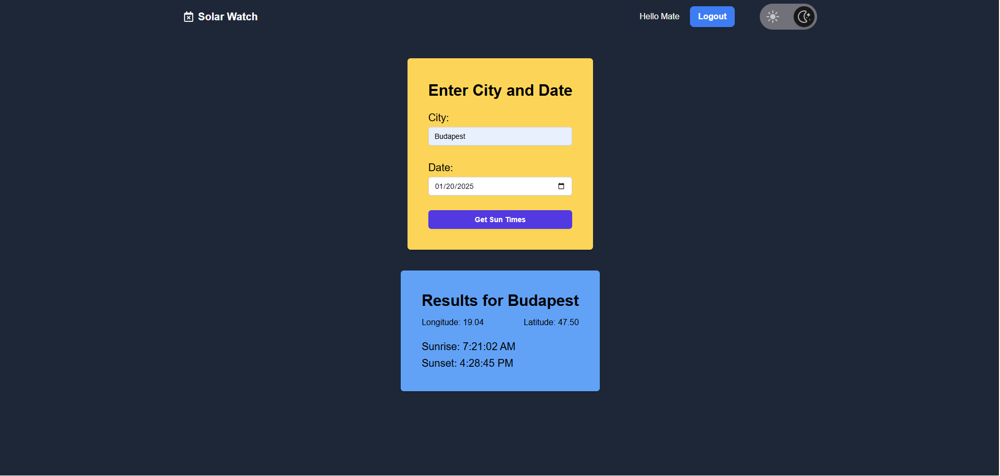
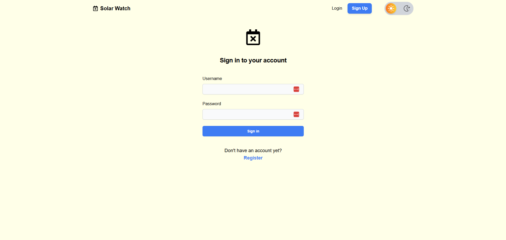

<!-- PROJECT LOGO -->
<br />
<div align="center">
  <a>
    
  </a>

<h1 align="center">Solar Watch</h1>

  <p align="center">
    Your go-to tool for accurate sunrise and sunset times worldwide!
</p>
</div>

<!-- TABLE OF CONTENTS -->
<details>
  <summary>Table of Contents</summary>
  <ol>
    <li>
      <a href="#about-the-project">About The Project</a>
      <ul>
        <li><a href="#built-with">Built With</a></li>
      </ul>
    </li>
    <li><a href="#contributors">Contributors</a></li>
    <li>
      <a href="#getting-started">Getting Started</a>
      <ul>
        <li><a href="#prerequisites">Prerequisites</a></li>
        <li><a href="#installation">Installation</a></li>
      </ul>
    </li>
    <li><a href="#usage">Usage</a></li>
    <li><a href="#stopping-the-containers">Stopping the Containers</a></li>
    <li><a href="#troubleshooting">Troubleshooting</a></li>
    <li><a href="#roadmap">Roadmap</a></li>
    <li><a href="#acknowledgments">Acknowledgments</a></li>
  </ol>
</details>


<!-- ABOUT THE PROJECT -->
## About The Project
Solar Watch is a website where users can log in, provide a city and a date, and instantly get information about the sunrise and sunset times for the selected location.
Solar Watch is built with a Java Spring Boot backend, a PostgreSQL database for storing user data, and a modern Vite React frontend. 
The entire application is containerized using Docker to ensure seamless deployment and scalability.
We hope Solar Watch will brighten your day with accurate solar insights!

### Built With
- Backend:   
  [![SpringBoot][SpringBoot]][SpringBoot-url]
- Database:  
  [![PostgreSQL][PostgreSQL]][PostgreSQL-url]
- Frontend:  
   [![React][React.js]][React-url]
   [![Vite][Vite]][Vite-url]
   [![TailwindCSS][TailwindCSS]][TailwindCSS-url]
- Containerization:  
  [![Docker][Docker]][Docker-url]
  [![NGINX][NGINX]][NGINX-url]


<!-- CONTACT -->
## Contact

* Pojbics Máté: https://github.com/matet2001 - matet2001@gmail.com  
[![LinkedIn][linkedin-shield]][linkedin-url]

<!-- GETTING STARTED -->
## Getting Started

To set up the project locally and start using it, follow the steps outlined below. 
This section will guide you through the process of preparing your environment, installing necessary dependencies, and running the application.
By the end of this guide, you’ll have the project running on your local machine.

### Prerequisites

Before running the project, ensure you have the following installed:
- Docker, you can install it from this link: https://docs.docker.com/engine/install/
- Docker Compose, you can install it from this link: https://docs.docker.com/compose/install/

### Installation

Here you find the steps of the installation of our project:
1. Clone the repository
    ```
    git clone https://github.com/CodecoolGlobal/solarwatch-frontend-javascript-matet2001.git
    cd solarwatch-frontend-javascript-matet2001
    ```

2. Configure Environment Variables

   To set up your environment variables, simply copy and rename the `.env.example` file to `.env` in the root directory. You can do this using the following terminal command:

    ```bash
    cp .env.example .env
    ```

   Once copied, you can open the .env file and update the values to match your credentials and environment settings, if desired. For example:

    ```plaintext
    DB_PASSWORD=postgres
    DB_USERNAME=postgres
    JWT_SECRET=======================CodeCool=Spring===========================
    JWT_EXPIRATION=86400000
    ```

   Modifying the .env file is optional, but if you choose to do so, make sure that the credentials you provide are secure and appropriate for your environment.


3. Run the project with Docker

    Please enter in your terminal the following comment:
    ````
    docker-compose up --build
    ````

    This command will:
   - Build and start the PostgreSQL database.
   - Start the Spring Boot backend.
   - Start the Vite React frontend.

   The services will be available at:
    http://localhost

### Usage

Once the services are running, you can access the frontend to interact with the application and use the backend API for development or debugging purposes.

On the website, you can:
- Log in to your account for personalized access.
- Search for sunrise and sunset times by providing a city and a specific date.
- View solar information displayed in an easy-to-read format.
- Dark mode

This is the main page in dark mode: 




This is the login page: 



If you click to any box, you can see the details, you can edit and invite friends here too. 


### Stopping the Containers

To stop running  the containers enter the following command:
````
docker-compose down
````

<!-- ROADMAP -->
## Roadmap

- [x] Add Dockerize project
- [x] Add README
- [X] Testing
    - [X] Set up CI/CD pipeline
    - [ ] Increase coverage with more tests

<!-- ACKNOWLEDGMENTS -->
## Acknowledgments

* [React Icons](https://react-icons.github.io/react-icons/search)
* [Axios](https://axios-http.com/docs/intro)

[SpringBoot]: https://img.shields.io/badge/Spring%20Boot-6DB33F?style=for-the-badge&logo=springboot&logoColor=white
[SpringBoot-url]: https://spring.io/projects/spring-boot

[PostgreSQL]: https://img.shields.io/badge/PostgreSQL-336791?style=for-the-badge&logo=postgresql&logoColor=white
[PostgreSQL-url]: https://www.postgresql.org/

[React.js]: https://img.shields.io/badge/React-20232A?style=for-the-badge&logo=react&logoColor=61DAFB
[React-url]: https://reactjs.org/

[Vite]: https://img.shields.io/badge/Vite-646CFF?style=for-the-badge&logo=vite&logoColor=white
[Vite-url]: https://vitejs.dev/

[TailwindCSS]: https://img.shields.io/badge/TailwindCSS-06B6D4?style=for-the-badge&logo=tailwindcss&logoColor=white
[TailwindCSS-url]: https://tailwindcss.com/

[Docker]: https://img.shields.io/badge/Docker-2496ED?style=for-the-badge&logo=docker&logoColor=white
[Docker-url]: https://www.docker.com/

[linkedin-shield]: https://img.shields.io/badge/-LinkedIn-black.svg?style=for-the-badge&logo=linkedin&colorB=555
[linkedin-url]: https://www.linkedin.com/in/m%C3%A1t%C3%A9-pojbics/

[NGINX]: https://img.shields.io/badge/NGINX-009639?style=for-the-badge&logo=nginx&logoColor=white
[NGINX-url]: https://nginx.org/
